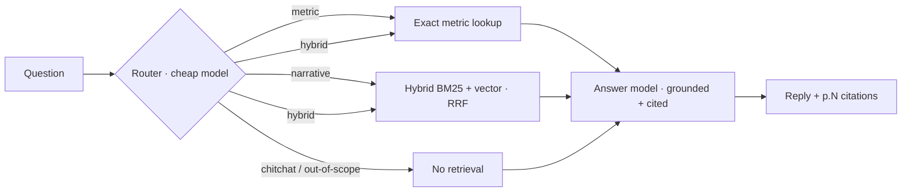

# TCB FY25 Chatbot — Architecture Write-up

A multi-turn assistant answering questions about Techcombank's FY25 results, grounded strictly in
the 14-page FY25 press release. One idea drives the whole design: **numbers are looked up, prose is
retrieved** — the model never recalls a figure from its own weights.

The companion [`SOLUTION.md`](./SOLUTION.md) is the long-form reasoning; this is the one-page
architecture brief. [`README.md`](./README.md) has run instructions.

## The problem

The press release has three genuinely different shapes: narrative prose (p.1–11), an acronym
glossary (p.12), and a dense financial table (p.13 — ~24 metrics against quarterly/FY columns).
Embedding all of it into one vector store is the failure the brief warns about: cosine similarity
can't tell adjacent table rows apart (CAR `14.6%` sits right above Tier-1 `13.7%`, same magnitude,
same trend), so a model reading a number off a retrieved chunk guesses. The architecture takes
numeric questions off that path entirely.

## Request flow

## 1. Ingestion — build-time, runs once (`ingest/`)

Splits the PDF by *shape* into three stores, committed to `data/artifacts/` and baked into the
image, so there's **no ingestion and no Bedrock dependency at request time**:

- **Narrative** — 25 section-aware chunks (p.1–11), embedded with Titan V2, retrieved by hybrid
  search.
- **Metrics** — 38 hand-verified records `{name, aliases, unit, values{period}, qoq, yoy, note,
  page}` transcribed from p.13; **exact lookup, never embedded, never LLM-parsed.**
- **Glossary** — 26 acronyms (p.12) used only for query expansion.

Pages 12–14 are deliberately excluded from narrative chunks.

## 2. Runtime pipeline — per request (`backend/app/services/`)

1. **Router** (cheap model) — classifies intent (`metric` / `narrative` / `hybrid` / `chitchat` /
   `out_of_scope`) and rewrites follow-ups ("what about Q3?") into a standalone query using recent
   history.
2. **Retrieval** — metric → exact alias/period lookup returning the verified value + `[p.N]`;
   narrative → hybrid BM25 + cosine over 25 in-memory chunks, fused with Reciprocal Rank Fusion,
   top 6; `chitchat`/`out_of_scope` → no retrieval *and* no answer call.
3. **Answer** — strict-grounding prompt: compose from context only, cite pages, refuse when
   uncovered, temp ≤ 0.2.

Anti-hallucination is **two independent layers**: the router scope-guards content (other years /
companies / investment advice) *before* any answer call; the prompt grounds context. They don't
share a failure mode.

## 3. LLM layer (`services/llm.py`)

Provider-pluggable — `LLM_PROVIDER` = `bedrock | anthropic | openai`; model IDs are plain settings
and `LLMClient` dispatches per provider. **Two tiers** (cheap for routing/simple lookups, capable
for analytical), plus an offline mock. This abstraction is what let the live deploy run on Claude
when the AWS account's Bedrock inference stayed gated account-wide.

## 4. Serving & infrastructure

- **One container** — FastAPI serves both the API and the built React SPA; sessions in DynamoDB
  (in-memory locally); a per-IP rate limiter sits in front of the paid LLM call. `docker compose
  up` runs the whole product.
- **IaC — Terraform, two stacks** — *bootstrap* (S3 state, GitHub OIDC role, ECR) applied once by
  hand; *main* (VPC, ALB, ECS Fargate, DynamoDB, Secrets Manager, budget) applied by CI. **Keyless
  CI via OIDC** — no AWS keys stored; the LLM key flows GitHub secret → Secrets Manager → task env,
  never baked into the image.
- **CI/CD** — push to `main`: `test → build+push → terraform apply → smoke test`. The smoke test is
  behavioral — it posts a real question and asserts the correct FY25 PBT figure appears, not just a
  200.
- Deployed live on ECS Fargate behind an ALB; **15/15 golden evals** on the Anthropic provider.

## Key trade-offs

| Decision | Why | Graduation trigger |
|---|---|---|
| Three-store split; numbers hand-curated | removes the hallucination-prone path; exact numeric answers | auto-extract + human-verify at many-document scale |
| In-process BM25 + cosine, no vector DB | 25 chunks, sub-5 ms, zero infra, unit-testable | multi-document / multi-year corpus |
| Public subnets, no NAT; ALB HTTP; admin CI role | cost/time for a throwaway review env | private subnets + VPC endpoints, WAF + HTTPS, scoped role |
| Pluggable provider | unblocked the deploy from the Bedrock account gate | — |

## What I'd add next

SSE streaming · Vietnamese support (metric aliases + period parsing, not just the prompt) ·
long-session summarization · multi-doc corpus → managed KB · cross-encoder re-rank · runtime
groundedness guardrail.
