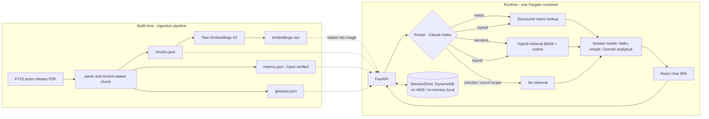

# Techcombank FY25 Results Assistant

A chat assistant that answers questions about Techcombank's FY25 (fiscal year ended 31 Dec 2025)
results, grounded exclusively in the official FY25 press release. It is deliberately not a
"paste the whole PDF into an LLM" solution and not a generic vector-database RAG stack — it's a
right-sized retrieval design built around where naive RAG actually breaks on *this* document. The
full reasoning is in [`SOLUTION.md`](./SOLUTION.md).

> **TODO (pending):** demo video — recorded last, once the rest of the submission (including the
> live deploy below) is finalized.

> **TODO (pending):** live URL — not deployed as of this write-up; `infra/bootstrap`'s apply is a
> manual one-time step (see "AWS deployment" below) that hasn't been run yet. It will be deployed
> before final submission and the URL shared here / in the demo video. It may be torn down
> afterward to control AWS cost — redeploying is a single `git push` to `main`, since the whole
> build → infra-apply → smoke-test pipeline is automated end to end.

---

## Quickstart (local, < 3 minutes)

```bash
git clone https://github.com/ngotoandev/tcb-fy25-chatbot.git
cd tcb-fy25-chatbot
cp .env.example .env        # paste AWS creds with Bedrock access (us-east-1) — or see below
docker compose up --build   # ~2 min build (frontend + backend, one multi-stage image)
```

Then open **http://localhost:8080** — the FastAPI container serves both the API and the built
React SPA.

**No AWS credentials?** Set `MOCK_LLM=true` in `.env` instead of pasting keys. The app boots and
the full UI is clickable with canned, deterministic replies — no Bedrock call is ever made. This
exists specifically so a reviewer can inspect the running product without first needing Bedrock
model access provisioned on their own account.

Nothing needs to be built or ingested before this works: `data/artifacts/` (chunks, hand-verified
metrics, glossary, embeddings) is pre-built and committed to the repo, and gets baked into the
image by the `Dockerfile`. Rebuilding those artifacts from the source PDF — only needed if the
source document itself changes — is `make ingest` (requires Bedrock, for the embeddings step
only).

---

## Architecture



This 14-page document yields 25 section-aware narrative chunks across pages 1–11 (pages 12–14 —
the acronym glossary, the financial summary table, and a blank closing page — are deliberately
*not* chunked as narrative; see `SOLUTION.md` §1). In-process hybrid search (numpy cosine + BM25)
over 25 chunks is exact, sub-5ms, and needs zero extra infrastructure — a vector database here
would be solving a problem this corpus doesn't have. `SOLUTION.md` §4 names the graduation path
(Bedrock Knowledge Bases / OpenSearch) and the trigger for when that stops being true.

---

## Repo map

- **`backend/`** — FastAPI service: config, request/response models, `api/chat.py`, and the
  pipeline services (`router_svc`, `retrieval`, `metrics_store`, `llm`, `answerer`), plus
  pluggable session stores (in-memory / DynamoDB).
- **`frontend/`** — React + TypeScript + Vite + Tailwind chat SPA: message thread, citation
  chips, route/model badges, session persistence.
- **`ingest/`** — build-time pipeline (not run at request time): PDF parsing, section-aware
  chunking, hand-verified metrics/glossary extraction, Titan embeddings.
- **`data/artifacts/`** — the pipeline's output, committed to the repo: `chunks.json`,
  `metrics.json`, `glossary.json`, `embeddings.npz`. Baked into the Docker image so the app boots
  with zero Bedrock dependency.
- **`reports/`** — the source FY25 press release (PDF + parsed text) — public on
  techcombank.com.
- **`infra/bootstrap/`** — one-time, hand-applied Terraform: state bucket, GitHub OIDC provider +
  CI role, ECR repo.
- **`infra/main/`** — CI-applied Terraform: VPC, ALB, ECS Fargate service, DynamoDB sessions
  table, S3 artifacts bucket, CloudWatch logs, AWS Budget alert.
- **`.github/workflows/`** — `deploy.yml` (push to `main`) and `pr.yml` (tests + `terraform
  plan`).
- **`tests/`** — pytest suite: unit/integration (no AWS) plus the golden-eval suite (opt-in,
  needs Bedrock — see `SOLUTION.md` §5).
- **`docs/superpowers/`** — the design spec and implementation plan this project was built from.
- **`Dockerfile`, `docker-compose.yml`** — multi-stage build (frontend → static assets, backend →
  FastAPI) and the single-command local run.
- **`Makefile`** — `make ingest` / `dev` / `test` / `evals`.
- **`pytest.ini`, `requirements-dev.txt`** — test configuration and dev-only dependencies.

---

## AWS deployment

One-time bootstrap — creates the Terraform state bucket, the GitHub OIDC role CI assumes, and the
ECR repo. Applied once by hand, never by CI:

```powershell
terraform -chdir=infra/bootstrap init
terraform -chdir=infra/bootstrap apply -var "github_repo=ngotoandev/tcb-fy25-chatbot"
```

Type `yes`, then record the three outputs (`ci_role_arn`, `tfstate_bucket`, `ecr_repo_url`).

Then, in the repo's **Settings → Secrets and variables → Actions → Variables**, set:

- `AWS_ROLE_ARN` = the `ci_role_arn` output
- `TFSTATE_BUCKET` = the `tfstate_bucket` output
- `ALERT_EMAIL` = an email address for the budget alert

From there, deployment is fully automated: **push to `main` → the pipeline deploys.**
`.github/workflows/deploy.yml` runs on every push to `main` (and on manual dispatch): `test`
(pytest + frontend build + `terraform fmt`/`validate`) → `build-and-push` (Docker image → ECR,
tagged with the git SHA) → `terraform-apply` (OIDC-authenticated `terraform apply` against
`infra/main`) → `smoke-test` (waits for the ECS service to stabilize, polls `/api/health`, then
posts one real chat question to the live ALB and asserts the reply is grounded — contains the
correct FY25 PBT figure, not just a 200 status) → `deployment-status`. Pull requests run the
lighter `pr.yml`: tests + `terraform plan` only, no apply.

No AWS credentials are stored as GitHub secrets — the CI role is assumed via OpenID Connect
(`infra/bootstrap`'s `aws_iam_openid_connect_provider` + a trust policy scoped to
`repo:ngotoandev/tcb-fy25-chatbot:*`).

---

## Testing

```bash
pytest                 # unit + integration — no AWS credentials needed
pytest -m eval -s      # golden evals against real Bedrock — needs AWS creds with Bedrock access
```

`pytest` runs the unit/integration suite (35 tests as of this writing) with Bedrock mocked or
bypassed entirely: PDF chunker boundaries, metric alias/period matching, hybrid-retrieval RRF
fusion (including its out-of-vocabulary fallback path), router JSON parsing, the Bedrock client's
retry/backoff logic, and the `/api/chat` pipeline end-to-end via `MOCK_LLM`. None of it touches a
real AWS account.

`pytest -m eval` is opt-in — excluded by default via `pytest.ini`'s `addopts = -m "not eval"` —
and is designed to hit live Bedrock for a 15-case golden suite (exact-metric questions, narrative
questions, a multi-turn follow-up chain, and out-of-scope refusal traps). As of this write-up the
suite is fully specified but not yet implemented as runnable test files — both wait on Bedrock
model access for this AWS account; see `SOLUTION.md` §5 for the full design and the current
status.

CI runs the non-eval half automatically on every push/PR (`test` job: pytest + frontend build +
`terraform validate`/`fmt`), plus a live **smoke test** post-deploy that hits the real ALB —
`curl /api/health`, then one real `/api/chat` question with an assertion that the reply is
grounded, not just that it returns 200.
