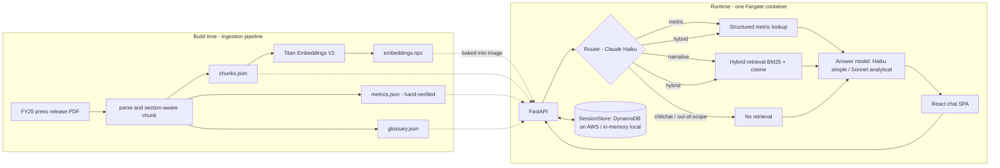

# Design: TCB FY25 Results Chatbot (Take-Home Assignment)

**Date:** 2026-07-08 · **Target: complete in 48h** (24h buffer before the 72h deadline)
**Status:** Approved approach B — custom right-sized RAG on AWS primitives.

---

## 1. Problem statement

Build a chatbot on AWS that answers questions about Techcombank's FY25 performance,
grounded exclusively in the official FY25 press release (14 pages). Graded against:

| # | Acceptance criterion | How this design satisfies it |
|---|---------------------|------------------------------|
| 1 | Containerized FastAPI backend | Single Docker image: FastAPI serves API + built SPA |
| 2 | All infra as IaC, deployed via GitHub Actions | Terraform (bootstrap + main), OIDC-authenticated `deploy.yml` |
| 3 | Chat frontend, multi-turn + follow-ups | React+TS SPA; server-side sessions; query rewriting resolves follow-ups |
| 4 | Strict grounding, no hallucination | Structured metric store + grounded prompting + citations + refusals + golden eval suite |
| 5 | Repo runs from clone in 3 min | `docker compose up` with only AWS creds in `.env`; artifacts pre-built; `MOCK_LLM` fallback |
| 6 | Demo video | Shot-by-shot script provided (candidate records) |
| 7 | Write-up of solution + thinking | `SOLUTION.md` with decisions, trade-offs, RAG limitations, costs, scaling path |

### Decoding the hints

- **"Unstructured → structured, with a process"** — the document is ~10 pages of narrative
  + 1 glossary page + 1 dense financial summary table (page 13) holding most of the numbers.
  We treat these as **three different knowledge stores**, not one.
- **"Should the whole doc be in one knowledge base? Limitation of RAG?"** — No. Naive
  chunk-and-embed mangles the financial table: headers separate from rows, cosine similarity
  confuses periods (4Q24 vs 4Q25) and metrics (NIM vs CIR vs CAR), and the LLM fills gaps by
  guessing numbers. Numbers must come from an **exact, verified structured lookup**.
- **"Doc into ChatGPT API = wrong solution"** — no whole-document context stuffing; retrieval
  selects only relevant context, structured data answers numeric questions.
- **"Model efficiency"** — explicit router: cheap model for classification/rewriting/simple
  answers; capable model only for analytical synthesis.

---

## 2. Architecture overview

**Right-sizing argument (state this in the write-up and interview):** one 14-page document
yields ~80 chunks. In-process hybrid search (numpy cosine + BM25) is exact, fast (<5 ms),
free, and has zero infra. A vector database for this corpus is over-engineering; the write-up
names the graduation path (Bedrock Knowledge Bases / OpenSearch) and the trigger (corpus
growth, multi-doc, re-ranking needs).

---

## 3. Components

### 3.1 Ingestion pipeline (`ingest/`) — build-time, not runtime

1. **Parse** PDF with `pdfplumber` → per-page text.
2. **Section-aware chunking** — split on the document's own headings (FY25 HIGHLIGHTS,
   INCOME STATEMENT, BALANCE SHEET, subsidiary sections, CUSTOMER AND OTHER HIGHLIGHTS,
   AWARDS…), then pack to ~300 tokens with metadata `{chunk_id, section, page}`.
3. **Structured metrics extraction** — page-13 summary table + key in-text figures →
   `metrics.json`: `{metric_id, name, aliases[], unit, period, value, qoq, yoy, source_page}`.
   **Hand-verified against the rendered PDF page** — this curation step is the "process to
   manage unstructured → structured" the hint asks for; verification is documented in the
   write-up.
4. **Glossary** (page 12) → `glossary.json` acronym map, used for query expansion
   (e.g. "CASA" ↔ "current account savings account").
5. **Embeddings** — Bedrock **Titan Text Embeddings V2** (1024-d) per chunk → `embeddings.npz`.
6. Artifacts (<1 MB total) are **committed** and baked into the Docker image: deterministic
   startup, no Bedrock dependency at boot, clone-to-run stays under 3 minutes. Rebuild with
   `make ingest` when the source changes.

### 3.2 Backend (`backend/`, FastAPI)

Endpoints:
- `POST /api/chat` `{session_id, message}` → `{reply, citations[], route, model, latency_ms}`
- `GET /api/health` — ALB health check + CI smoke test
- `GET /` — serves the built SPA

Query path per message:
1. **Router call (Claude Haiku, temp 0, JSON output):** given last N turns + message,
   produce `{intent: metric|narrative|hybrid|chitchat|out_of_scope, standalone_query,
   complexity: simple|analytical}`. The standalone rewrite resolves follow-ups
   ("what about Q3?" → "What was the CASA ratio in 3Q25?").
2. **Retrieval by intent:**
   - `metric` → alias+period match against `metrics.json` (exact numbers, no embedding involved)
   - `narrative` → BM25 + cosine over chunk embeddings, reciprocal-rank fusion, top 6
   - `hybrid` → both; `chitchat`/`out_of_scope` → no retrieval
3. **Answer call:** Haiku for `simple`, Sonnet for `analytical`. System prompt: answer ONLY
   from provided context; cite pages `[p.N]`; if the answer is not in context, say so and
   decline. Temp ≤ 0.2.
4. **Session update** — append turn to `SessionStore` (interface: DynamoDB impl on AWS,
   in-memory impl locally; TTL 24h).

Resilience: Bedrock client with retry + exponential backoff (new-account quotas are low),
per-session rate limiting middleware, request timeout, structured logs of route/model/tokens.

`MOCK_LLM=true` env flag: canned deterministic responses so the app runs with zero AWS
credentials (UI inspection / CI without secrets).

### 3.3 Frontend (`frontend/`, React + TypeScript + Vite + Tailwind)

- Chat thread with user/bot bubbles; **citation chips** under bot replies expanding to the
  source snippet + page number.
- Subtle **route/model badge** per reply (e.g. `metric · haiku`, `analytical · sonnet`) —
  makes model routing visible in the demo video.
- Suggested starter questions; `session_id` in localStorage; "New chat" resets.
- Non-streaming responses (SSE streaming cut for 48h scope — noted as future work).

### 3.4 Infrastructure (`infra/`, Terraform, us-east-1)

- **`infra/bootstrap/`** (one-time manual apply): S3 state bucket, DynamoDB lock table,
  GitHub OIDC provider, CI IAM role scoped to this repo.
- **`infra/main/`** (CI-applied): minimal VPC (2 AZs, public subnets, IGW), ECR, ECS cluster
  + Fargate service (0.5 vCPU / 1 GB, desired 1), task role (`bedrock:InvokeModel`,
  DynamoDB RW on sessions table), ALB + target group + `/api/health` check, DynamoDB
  sessions table (on-demand, TTL), S3 artifacts bucket (source PDF + pipeline outputs,
  versioned), CloudWatch log group, **AWS Budget alert** (email at $10).
- us-east-1: broadest Bedrock model access for a brand-new account, lowest token prices.
  Production note in write-up: private subnets + VPC endpoints, WAF, Cognito.
- Estimated cost for the exercise: **≈ $5–10 total** (Fargate+ALB ≈ $1.50/day, Bedrock
  tokens < $5, everything else pennies). Teardown: `terraform destroy` after review or keep
  until interview.

### 3.5 CI/CD (`.github/workflows/`)

- **`deploy.yml`** (push to main / manual dispatch), job graph mirroring the assignment's
  example screenshot: `test` (pytest, frontend build, `terraform fmt -check`/`validate`) →
  `build-and-push` (image → ECR, tag = git SHA) → `terraform-apply` (OIDC role, plan+apply
  with image tag) → `smoke-test` (curl `/api/health` + one real chat question against the
  ALB, assert grounded answer) → `deployment-status`.
- **`pr.yml`**: tests + `terraform plan` only.

---

## 4. Anti-hallucination strategy (acceptance criterion 4, made concrete)

1. **Exact numbers by construction** — metric answers inject values from the verified
   `metrics.json`; the LLM formats and explains but never recalls figures from weights.
2. **Grounded prompting** — context-only instruction, explicit refusal path, temp ≤ 0.2.
3. **Citations** — every retrieval-based reply carries `[p.N]` chips; UI shows the snippet.
4. **Scope guard** — router labels out-of-scope (FY23, competitors, live prices, advice);
   reply politely refuses and states the knowledge boundary (FY25 press release).
5. **Golden eval suite** (~15 cases, pytest): exact-metric Qs, narrative Qs, a multi-turn
   follow-up chain, and out-of-scope traps ("FY23 profit?", "VCB's CASA?", "TCB share price
   today?") asserting refusal. A Haiku-as-judge groundedness check scores narrative answers
   against retrieved context. Results table goes in `SOLUTION.md`.

---

## 5. Error handling

- Bedrock throttle/5xx → 3 retries, exponential backoff + jitter; user-facing "busy" message
  after exhaustion; never a stack trace in chat.
- Router JSON malformed → single re-ask, then default `{narrative, original query, analytical}`
  (safe fallback: retrieval still bounds the answer).
- Metric lookup miss → fall through to hybrid retrieval rather than guessing.
- DynamoDB unavailable → degrade to stateless single-turn with a visible notice in logs.
- ALB health check only passes when artifacts loaded and config valid (fail fast at boot).

---

## 6. Testing

- **Unit** (no AWS): chunker boundaries, metric alias/period matching, RRF fusion, prompt
  assembly, session TTL, router-output parsing (fixtures).
- **Integration** (mocked Bedrock): full `/api/chat` flow both routes; `MOCK_LLM` path.
- **Golden evals** (real Bedrock, marked `@eval`, run manually + pre-submission): §4.5.
- **Smoke** (CI, post-deploy): health + one grounded chat round-trip against live ALB.

---

## 7. 48-hour execution schedule

| Window | Work |
|--------|------|
| **H0–3 (tonight)** | AWS account creation, Bedrock model access request (Claude Haiku/Sonnet, Titan embeddings — do this FIRST, approval latency is the one uncontrollable), GitHub repo, budget alert, verify `InvokeModel` works from local CLI |
| **H3–12** | Ingestion pipeline + hand-verified artifacts; backend core: router → retrieval → generation; unit tests; docker compose; minimal chat page proving end-to-end locally |
| **H12–24** | Frontend proper (chat UI, citations, badges, sessions); multi-turn rewriting; polish + error handling |
| **H24–36** | Terraform bootstrap + main; first deploy; GitHub Actions deploy.yml green end-to-end incl. smoke test |
| **H36–44** | Golden eval suite + fixes; SOLUTION.md; README; clean-clone 3-minute test on a fresh directory |
| **H44–48** | Demo video (script provided), final review, submit. Remaining 24h of the official window = buffer + interview prep |

---

## 8. Risks & mitigations

| Risk | Mitigation |
|------|------------|
| New-account Bedrock access/quota delays | Request access at H0; retries+backoff; Haiku-first routing keeps TPM low; fallback region documented |
| OIDC bootstrap friction | Isolated `infra/bootstrap` with step-by-step README; applied once manually |
| Public ALB abuse during review window | Per-session rate limit, 1-task cap, $10 budget alert, teardown after review |
| Page-13 table extraction errors | Metrics hand-verified against rendered PDF page images; eval suite asserts exact figures |
| Windows local dev friction | Docker Desktop + WSL2 assumed; compose is the only local entry point |
| Judge has no AWS creds when cloning | `MOCK_LLM=true` documented in README quickstart |

---

## 9. Out of scope (named in write-up as future work)

SSE streaming, Cognito/WAF, private subnets + VPC endpoints, multi-document corpus +
Bedrock Knowledge Bases graduation, re-ranking models, Vietnamese-language support,
conversation summarization for long sessions.

---

## 10. Submission package

Public GitHub repo (assignment PDF itself excluded; source press release included — it is
public on techcombank.com) containing code, IaC, README (3-min quickstart), SOLUTION.md
(thinking + decisions + eval results + costs), demo video link, and a green Actions run
whose graph mirrors their example screenshot.
